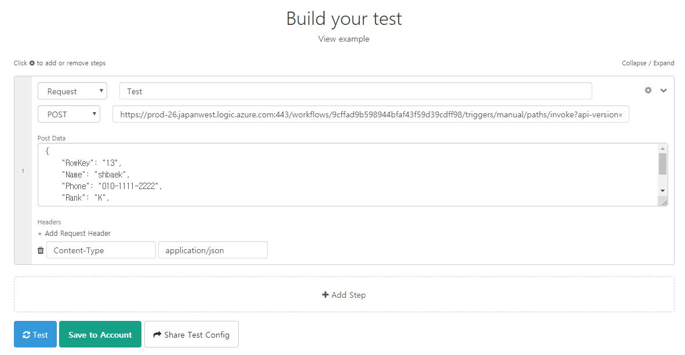

# Create a search service using the Azure services

## Scenario
> Azure 서비스 만을 이용하여 API 서비스를 만들어 봅시다.

## Prerequisite
- [Azure Search](https://docs.microsoft.com/ko-kr/azure/search/)
- [Azure API Management](https://docs.microsoft.com/ko-kr/azure/api-management/)
- [Azure Logic Apps](https://docs.microsoft.com/ko-kr/azure/logic-apps/)
- [Azure Storage Explorer](https://azure.microsoft.com/ko-kr/features/storage-explorer/)

## Step 1 : Create an Azure Search service
1. Create Azure Search account
2. Copy an one of the Search Keys
3. Create an index
   - Click the Add index button
   - Configure the index's field by using the teaminfo.csv file

## Step 2 : Index an Azure Storage Table in Azure Search
1. Create an Azure Storage account
2. Create a Table
3. Upload data to Azure Tables
   - Upload data using Microsoft Azure Storage Explorer (In the Overview section, select Open in Explorer)

## Step 3 : Create an Azure Search indexer
1. Access the Azure Search service that you created earlier
2. Click the Import data button in Overview section
3. Create a new indexer with the following details:
   - Data Source : Azure Table Storage
   - Data Source Name : blah~ blah~ blah~
   - Connection string : Click Choose an existing connection and select the Storage account you created earlier
   - Table Name : Enter table name you created earlier
   - Index name : blah~ blah~ blah~
   - Key : RowKey
   - Indexer name : blah~ blah~ blah~
   - Schedule : Custom
   - Interval : 5
4. Click the Indexers tab and Indexer name
5. Manually run the indexer you created

## Step 4 : Validate the indexed table data
+ Execute the following query
   - <code>search=name</code>
   - <code>$fitler=RankValue lt 30, $filter=RankValue eq 20, $filter=RankValue ge 30</code>

## Step 5 : Create an API Management service
1. Create an API Management resource
   - It may take between 20 and 30 minutes to create an API Management service
2. Click the Blank API
   - Display name : <code>ES Sales user info API</code>
   - Name : <code>essales-user-api</code>
   - Web service URL : <code>https://&lt;Search Service name&gt;.search.windows.net/indexes/&lt;index name&gt;/docs</code>
   - API URL suffix : <code>essales</code>
   - Products : Select both the Starter and Unlimited options
3. Add a new operation and click the Add operation
   - Display name : <code>List all user</code>
   - Name : <code>list-all-user</code>
   - URL : <code>GET /</code>
   - Click the Save Button 
4. Click the Add policy in the Inbound processing tab
> The following sections between 5 and 11 are execute in the Inbound processing tab
5. Click the Set headers
6. Add a new Set header with the following details :
   - Name : <code>api-key</code>
   - Value : <code>Your Azure Search Service Key </code>
   - Action : <code>append</code>
7. Click the Save button
8. Click the Add policy in the Inbound processing tab
9.  Click the Set query parameters
10. Add a new Set query parameters with the following details :
    - Name : <code>api-version</code>
    - Value : <code>2019-05-06</code>
    - Action : <code>override</code>
11. Add a new Set query parameters with the following details :
    - Name : <code>search</code>
    - Value : <code>*</code>
    - Action : <code>override</code>
12. Click the Add policy in the Outbound processing tab
> The follwing sections between 13 and 18 are exectue in the Outbound processing tab
13. Click the Set headers
14. Add a new Set headers with the following details :
    - Name : <code>preference-applied</code>
    - Action : <code>delete</code>
15. Add a new Set headers with the following details :
    - Name : <code>odata-version</code>
    - Action : <code>delete</code>
16. Add a new Set headers with the following details :
    - Name : <code>powered-by</code>
    - Value : <code>HancomMDS</code>
    - Action : <code>override</code>
17. Click the Policies(**</>**) 
18. Replacing that block of XML with the following XML :
<pre><code> &lt;outbound&gt;
        &lt;base /&gt;
        &lt;set-body&gt;
        @{
            var response = context.Response.Body.As&lt;JObject&gt;();
            return response.Property("value").Value.ToString();
        }
        &lt;/set-body&gt;
   &lt;/outbound&gt;
</code></pre>

## Step 6 : Insert new data into Azure Tables by using Azure Logic Apps
1. Create a Logic Apps
2. Create a trigger for Logic Apps workflow
   - Click the Logic app designer, select the Blank Logic App
   - Enter "When a HTTP request is received" in the Search connectors and triggers
   - Select the When a HTTP request is received in Triggers tab
   - Click "Use sample payload to generate schema"
   - In the Enter or paste a sample JSON payload window, enter the following JSON object
  <pre><code> {
        "RowKey": "",
        "Name": "",
        "Phone": "",
        "Rank": "",
        "RankValue": 0,
        "Team": ""
    }
  </code></pre>
3. Create a connector for Azure Storage
   - Click the New step
   - Enter "Insert or replace entity" in the Search connectors and triggers
   - Select the Insert or Replace Entity
   - Enter connection name
   - Select Storage Account
   - Click the Create button
   - In the Table list, select table
   - In the Partition Key, select Team
   - In the Row Key, select RowKey
   - In the Entity, select Body
4. Create a HTTP response action
   - Click the New step
   - Enter "Response" in the Search connectors and triggers
   - Select the Response in Actions tab 
   - In the Status Code, enter 201
   - Click the Body field, select Body in the Insert or Replace Entity category
   - In the Designer area, click the Save button
5. Retrieve a HTTP POST URL
   - In the Designer area, click the When a HTTP request is received action
   - Copy the URL in the HTTP POST URL field
6. Test Logic App
   - Go to the [API Tester](https://apitester.com/)
   - > You can also use API test tool such as POSTMAN
   - See the following picture :
   - >
   - In the Test type field, select Request, enter test name
   - In the Method field, select POST
   - Enter the HTTP POST URL that you copied
   - In the Post Data field, enter the following JSON object
  <pre><code>{
        "RowKey": "13",
        "Name": "shbaek",
        "Phone": "010-1111-2222",
        "Rank": "K",
        "RankValue": 30,
        "Team": "es"
  }
  </code></pre>
   - Click the Add Request Header
   - In the Name field, enter "Content-Type"
   - In the Value field, enter "Application/json"
   - Click the Test button
   - Check your Azure Table by using Azure Storage Explorer

